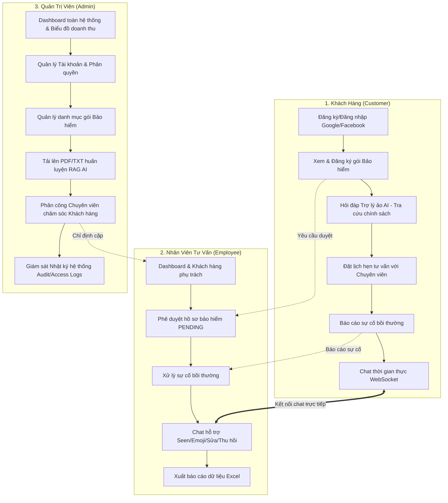
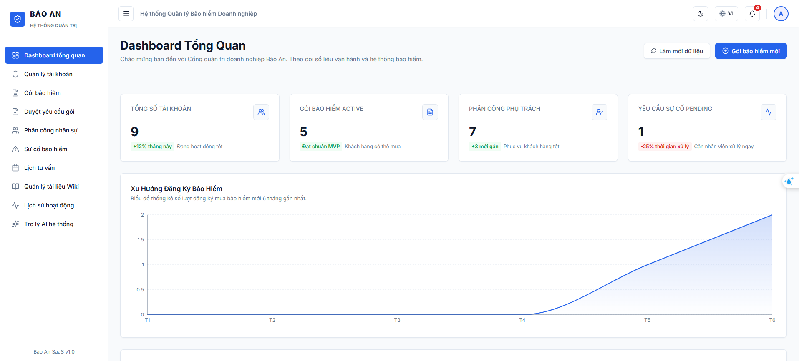
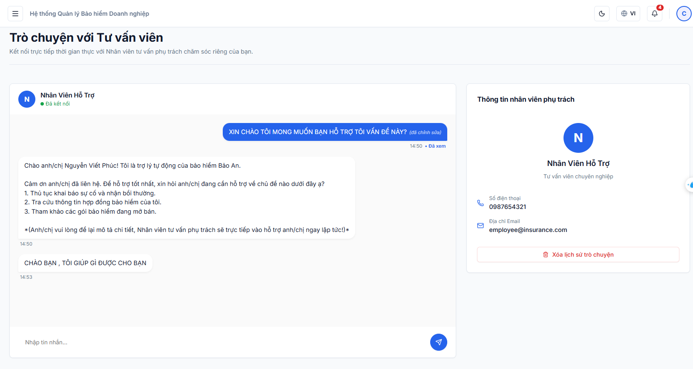
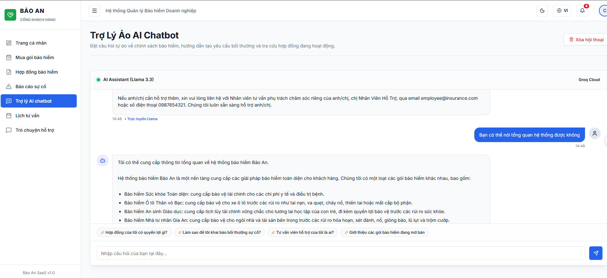
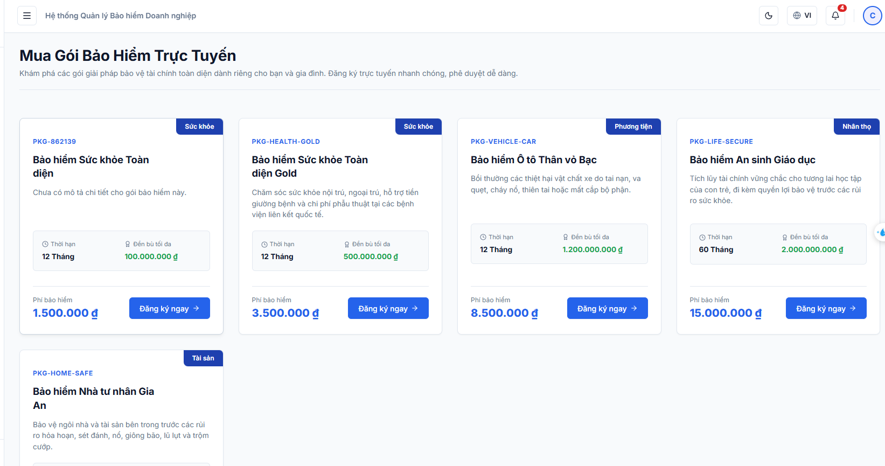

# 🛡️ Bảo An Insurance - Hệ Thống Quản Lý Bảo Hiểm Thông Minh

Hệ thống quản lý công ty bảo hiểm toàn diện (Bảo An Insurance) là giải pháp chuyển đổi số tối ưu hóa quy trình vận hành bảo hiểm. Dự án tích hợp các chức năng cốt lõi của CRM, quản lý nghiệp vụ, tự động hóa bằng AI, giao tiếp thời gian thực (Real-time WebSockets) và hệ thống lưu vết bảo mật (Audit Trails).

Dự án được xây dựng với mục tiêu cung cấp trải nghiệm sử dụng cao cấp, mượt mà và an toàn cho cả 3 nhóm đối tượng: **Quản trị viên (Admin)**, **Chuyên viên tư vấn (Employee)** và **Khách hàng (Customer)**.

---

## 🌟 Tính Năng Nổi Bật (Key Features)

### 1. 🤖 Trợ Lý Ảo AI Thông Minh (RAG Chatbot)
* **Truy xuất tài liệu động (Retrieval-Augmented Generation)**: Chatbot không trả lời dựa trên suy đoán mà tự động trích xuất nội dung từ các văn bản chính sách bảo hiểm dạng PDF hoặc TXT do Admin tải lên.
* **Xử lý tài liệu nâng cao**: Tích hợp **Apache PDFBox** ở Backend để phân tách và lập chỉ mục nội dung.
* **Khả năng dự phòng (Fallback)**: Đảm bảo phản hồi thông minh và an toàn ngay cả khi gặp sự cố kết nối API AI.

### 2. 💬 Trò Chuyện Thời Gian Thực Cao Cấp (WebSocket Real-time Chat)
* **Kết nối liên tục**: Sử dụng giao thức **WebSocket (SockJS + STOMP)** đảm bảo nhắn tin hai chiều tức thời không trễ.
* **Trải nghiệm chat như ứng dụng chuyên nghiệp**:
  * Trạng thái soạn thảo (*Typing status*).
  * Biên nhận đã đọc (*Seen receipt* - hiển thị dấu chấm hoặc chữ `• Đã xem` tức thời).
  * Tương tác cảm xúc tin nhắn (*Emoji reaction*).
  * Chỉnh sửa tin nhắn đã gửi (*Edit message*).
  * Thu hồi tin nhắn lỗi (*Recall message*).
  * Badge đếm số tin nhắn chưa đọc sinh động.

### 3. 🔐 Bảo Mật & Phân Quyền Đa Tầng (Multi-role Authorization)
* **Backend Security**: Bảo vệ toàn diện hệ thống API bằng **Spring Security & JWT** (JSON Web Token), mã hóa mật khẩu người dùng với **BCrypt**.
* **Frontend Security**: Phân tuyến bảo mật ở phía client sử dụng `ProtectedRoute` của React Router, ngăn chặn truy cập trái phép.
* **Đăng nhập một chạm**: Hỗ trợ đăng nhập nhanh bằng **OAuth2 Google & Facebook**.

### 4. 📝 Kiểm Toán & Nhật Ký Hệ Thống (Audit Trail & Logs)
* **Access Logs**: Ghi nhận toàn bộ thông tin đăng nhập/đăng xuất kèm theo địa chỉ IP thiết bị để giám sát bảo mật.
* **Audit Logs**: Tự động lưu trữ vết mọi thao tác thay đổi dữ liệu nhạy cảm (duyệt hợp đồng, sửa gói bảo hiểm, xử lý sự cố...) làm bằng chứng đối soát hệ thống chống gian lận.

### 5. 📊 Dashboard & Thống Kê Trực Quan
* Biểu đồ doanh thu trực quan theo tháng và thống kê tổng số lượng hợp đồng, khách hàng hoạt động được dựng bằng thư viện **Recharts** (React).
* Cho phép **xuất file Excel** xuất báo cáo dữ liệu sự cố và danh sách khách hàng phục vụ nghiệp vụ nội bộ.

---

## 📐 Sơ Đồ Vận Hành & Vai Trò (System Workflow)

Hệ thống được vận hành khép kín qua 3 vai trò chính:



---

## 💻 Công Nghệ Sử Dụng (Tech Stack)

| Thành phần | Công nghệ | Chi tiết |
| :--- | :--- | :--- |
| **Frontend** | ReactJS, Vite, Tailwind CSS | Giao diện Single Page Application (SPA), responsive, tối ưu hiệu năng. |
| **Thư viện FE** | React Router, Axios, Recharts, SockJS | Quản lý route, gọi REST API, vẽ biểu đồ, kết nối WebSocket. |
| **Backend** | Spring Boot 3.x, Spring Web | Framework xây dựng RESTful API mạnh mẽ, dễ mở rộng. |
| **Bảo mật BE** | Spring Security, JWT, OAuth2 | Xác thực token, phân quyền method-level, tích hợp Google/Facebook. |
| **Dữ liệu & DB** | Spring Data JPA, Hibernate, MySQL | Quản lý kết nối cơ sở dữ liệu quan hệ, tự động map thực thể. |
| **AI Integration** | Apache PDFBox, REST Client | Phân tích PDF thô, kết nối LLM API thực hiện RAG Search. |
| **Truyền thông** | Spring WebSocket | Xử lý tin nhắn thời gian thực qua broker STOMP. |

---

## 🗄️ Thiết Kế Cơ Sở Dữ Liệu (Database Schema)

Hệ thống sử dụng cơ sở dữ liệu quan hệ **MySQL** được tổ chức chuẩn hóa chặt chẽ với các thực thể chính:

* `roles` & `users`: Quản lý tài khoản đăng nhập và phân quyền (ADMIN, EMPLOYEE, CUSTOMER).
* `customers` & `employees`: Lưu hồ sơ thông tin chi tiết từng đối tượng người dùng.
* `insurance_packages`: Thông tin về các gói bảo hiểm (mã gói, giá, thời hạn, quyền lợi tối đa, trạng thái).
* `customer_insurances`: Quản lý hợp đồng bảo hiểm đã mua (liên kết gói bảo hiểm, mã hợp đồng sinh ngẫu nhiên, ngày bắt đầu/kết thúc, trạng thái).
* `customer_assignments`: Bảng trung gian phân công Nhân viên chăm sóc Khách hàng 1-1.
* `incident_reports` & `incident_files`: Ghi nhận sự cố yêu cầu bồi thường của khách hàng kèm các file minh chứng đính kèm.
* `appointments`: Quản lý lịch hẹn tư vấn trực tuyến (ngày, giờ, ghi chú, trạng thái).
* `access_logs` & `audit_logs`: Lưu vết hoạt động đăng nhập và thay đổi nghiệp vụ để kiểm toán an toàn thông tin.
* `wiki_documents`: Lưu trữ dữ liệu text trích xuất từ file chính sách phục vụ RAG AI Chatbot.

---

## 📂 Cấu Trúc Thư Mục Dự Án (Project Structure)

### 🖥️ Frontend (React Vite)
```text
insurance-management-frontend/
├── src/
│   ├── api/          # Cấu hình Axios & các hàm gọi API backend
│   ├── components/   # Các UI Component dùng chung (Navbar, Sidebar, Button...)
│   ├── context/      # Quản lý state toàn cục (AuthContext, SocketContext)
│   ├── hooks/        # Custom hooks tiện ích
│   ├── layouts/      # Layout giao diện theo Role (AdminLayout, EmployeeLayout, CustomerLayout)
│   ├── pages/        # Các trang màn hình chức năng chính
│   ├── routes/       # Cấu hình định tuyến & ProtectedRoute
│   ├── styles/       # CSS/Tailwind cấu hình giao diện
│   └── utils/        # Hàm helper xử lý định dạng ngày tháng, tiền tệ
```

### ⚙️ Backend (Spring Boot)
```text
insurance-management-backend/
├── src/main/java/com/insurance/
│   ├── config/       # Cấu hình ứng dụng (CORS, DatabaseSeeder, AsyncConfig)
│   ├── controller/   # Lớp tiếp nhận và phản hồi API REST
│   ├── dto/          # Các đối tượng truyền dữ liệu (Request/Response)
│   ├── entity/       # Các thực thể ánh xạ database (JPA Entities)
│   ├── enums/        # Định nghĩa các hằng số phân loại (Role, Status)
│   ├── exception/    # Xử lý ngoại lệ tập trung (GlobalExceptionHandler)
│   ├── mapper/       # Chuyển đổi dữ liệu giữa Entity và DTO (MapStruct/Manual)
│   ├── repository/   # Giao tiếp với database (Spring Data JPA Repositories)
│   ├── security/     # Cấu hình Spring Security, JWT Filter, WebSocket Security
│   ├── service/      # Chứa toàn bộ logic nghiệp vụ hệ thống
│   └── util/         # Lớp tiện ích (JwtUtils, FileStorageUtils)
```

---

## 🚀 Hướng Dẫn Cài Đặt & Chạy Ứng Dụng (Installation & Setup)

### 📌 Yêu Cầu Hệ Thống (Prerequisites)
* **JDK 17** trở lên.
* **Node.js** (Phiên bản LTS).
* **MySQL Server** (Phiên bản 8.0 trở lên).
* **Maven** (Để build Backend).

---

### 1. Cấu Hình & Chạy Backend
1. **Tạo Database**: Đăng nhập vào MySQL và chạy lệnh tạo database:
   ```sql
   CREATE DATABASE insurance_management CHARACTER SET utf8mb4 COLLATE utf8mb4_unicode_ci;
   ```
2. **Cấu hình ứng dụng**: Mở file [application.properties](file:///d:/Java%20Project/Insurance%20company/insurance-management-backend/src/main/resources/application.properties) (hoặc `application.yml`) và chỉnh sửa thông tin kết nối database:
   ```properties
   spring.datasource.url=jdbc:mysql://localhost:3306/insurance_management?useSSL=false&serverTimezone=UTC
   spring.datasource.username=your_mysql_username
   spring.datasource.password=your_mysql_password
   ```
3. **Chạy ứng dụng**: Ở thư mục `insurance-management-backend`, chạy lệnh:
   ```bash
   mvn spring-boot:run
   ```
   *(Hệ thống tích hợp sẵn `DatabaseSeeder` sẽ tự động tạo bảng dữ liệu và chèn các tài khoản thử nghiệm ban đầu nếu database trống).*

---

### 2. Cấu Hình & Chạy Frontend
1. Di chuyển vào thư mục `insurance-management-frontend`.
2. Cài đặt các gói phụ thuộc:
   ```bash
   npm install
   ```
3. Khởi chạy ứng dụng ở chế độ phát triển (Development mode):
   ```bash
   npm run dev
   ```
4. Truy cập giao diện trên trình duyệt tại địa chỉ: `http://localhost:5173`.

---

## 🔑 Tài Khoản Kiểm Thử Mặc Định (Seed Accounts)

Bạn có thể sử dụng các tài khoản sau để kiểm tra đầy đủ luồng nghiệp vụ trên hệ thống:

| Vai trò | Email đăng nhập | Mật khẩu | Phạm vi dữ liệu & Nghiệp vụ |
| :--- | :--- | :---: | :--- |
| **Admin (Quản trị viên)** | `admin@insurance.com` | `123456` | Quản trị viên tối cao: Quản lý gói, xem biểu đồ doanh thu, cấu hình Wiki AI, xem nhật ký hệ thống. |
| **Employee (Nhân viên)** | `employee@insurance.com` | `123456` | Chuyên viên tư vấn: Phê duyệt hợp đồng, chat WebSocket hỗ trợ, xử lý sự cố, xuất báo cáo Excel. |
| **Customer (Khách hàng)** | `customer@insurance.com` | `123456` | Khách hàng: Mua bảo hiểm, chat trợ lý AI, đặt lịch hẹn, tạo báo cáo sự cố cần bồi thường. |

---

## 📸 Hình Ảnh Giao Diện Hệ Thống (Screenshots)

*Dưới đây là một số hình ảnh thực tế ghi nhận giao diện hiện đại và các chức năng chính của hệ thống:*

### 1. Dashboard Quản Trị Hệ Thống (Admin)
<div align="center">
  <!-- Thêm ảnh dashboard admin ở đây -->
  
  <p><i>Giao diện Dashboard Admin với biểu đồ doanh thu Recharts và thống kê tổng quan</i></p>
</div>

### 2. Kênh Chat Hỗ Trợ Khách Hàng (WebSocket Real-time)
<div align="center">
  <!-- Thêm ảnh giao diện chat ở đây -->
  
  <p><i>Tính năng trò chuyện trực tiếp thời gian thực, cập nhật trạng thái đã xem (seen) và tương tác emoji</i></p>
</div>

### 3. Trợ Lý Ảo AI Đọc Tài Liệu (RAG Chatbot)
<div align="center">
  <!-- Thêm ảnh trợ lý AI ở đây -->
  
  <p><i>Trợ lý ảo thông minh giải đáp điều khoản bảo hiểm tự động dựa trên tài liệu Wiki nội bộ</i></p>
</div>

### 4. Đăng Ký Gói Bảo Hiểm Trực Tuyến & Phê Duyệt
<div align="center">
  <!-- Thêm ảnh duyệt hồ sơ bảo hiểm ở đây -->
  
  <p><i>Quy trình phê duyệt hồ sơ yêu cầu mua bảo hiểm và tự động kích hoạt mã hợp đồng</i></p>
</div>
